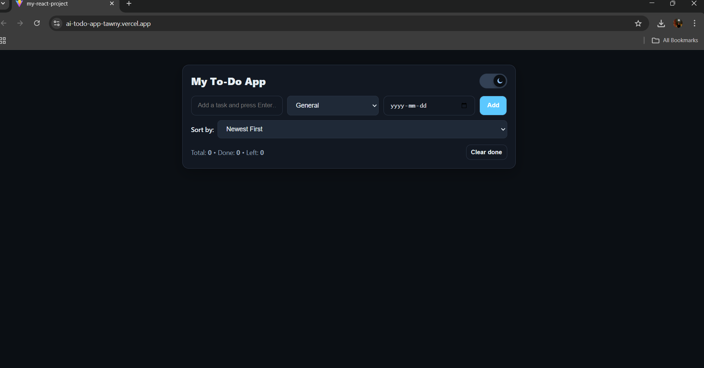
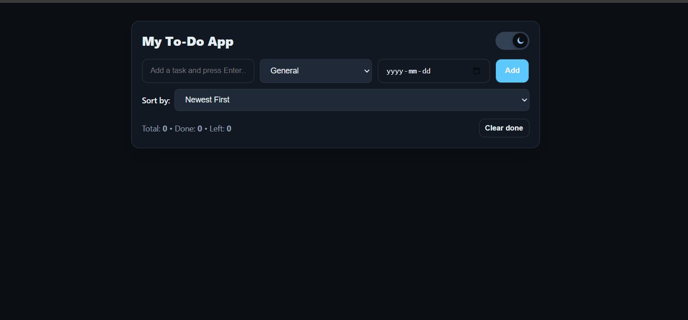

# AI To-Do App

A modern, professional **To-Do Application** built with **React + Vite**.
It combines productivity features with a clean UI, dark moode, and smart task management

# Live Demo
[View here](https://ai-todo-app-tawny.vercel.app/)

## Preview

### Dark Mode

### Demo

## Features
**Dark/Light Mode** toggle with smooth switch effect
**Categories** for organizing tasks
**Deadlines & Sorting** (overdue, today, upcoming)
**Edit & Delete** tasks
**Clean & responsive UI** (works on desktop and mobile)

## Tech Stack
- [React] + [Vite]
- [CSS] for styling
- [GitHub] for version control
- [Vercel] for deployment

---

## Future Improvements 
- AI- Auto-Categorization tast suggested into categories automatically
- AI-Motivational qoutes when tasks are completed
- Smart reminder for deadlines
